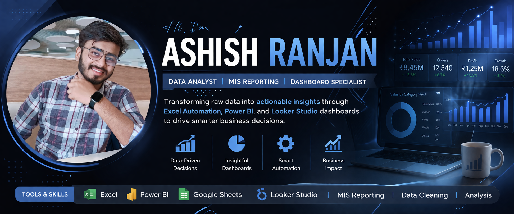

    

                         👋 Hi, I'm Ashish Ranjan
      💼 Data Analyst | MIS Reporting | Excel | Power BI | Looker Studio                         

I am a data-driven professional with experience in creating MIS reports, dashboards, and performing payment reconciliation. I convert raw data into meaningful insights to support business decisions.

---

## 🛠️ Skills
- 📊 Excel (Advanced, Pivot, Formulas, Automation)
- 📈 Power BI (Dashboard & DAX)
- 📉 Google Sheets (QUERY, IMPORTRANGE)
- 📊 Looker Studio (Interactive Dashboards)
- 🛒 E-commerce MIS (Myntra, IndiaMART)

---

 📊 Projects

🔹 Sales Dashboard
- Created dynamic dashboard using Excel & Power BI  
- Tracked daily, monthly sales & performance  

🔹 Myntra Payment Reconciliation
- Matched order data with settlement reports  
- Identified deduction differences (commission, shipping, rebate)  

🔹 Footfall Analysis
- Built report using Google Sheets & Looker Studio  
- Analyzed store performance & conversion rate

---
                                                   
- 📸 Dashboard Preview  🛠 “Based on real business scenarios”
 
 

---

📫 Contact Me
- 📧 Email: ashishranjan11211@gmail.com  
- 🔗 LinkedIn: linkedin.com/in/ashishranjanji09
---

⭐ Always learning and improving in Data Analytics
